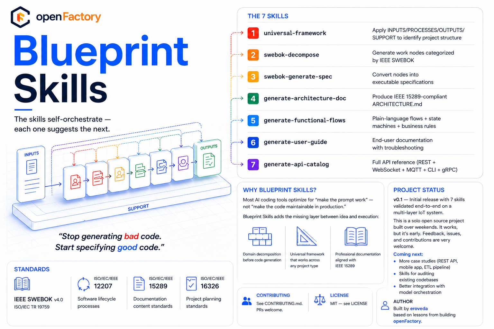

<div align="center">


# Blueprint Skills

**Domain decomposition + IEEE SWEBOK documentation for Claude Code**

Generate professional specifications and complete documentation from a project description in minutes.

[](https://opensource.org/licenses/MIT)
[]()
[](https://claude.com/plugins)

[Quick Start](#quick-start) · [The 7 Skills](#the-7-skills) · [Case Study](examples/iot-machine-monitoring/) · [Standards](#standards-alignment) · [Why Blueprint?](#why-blueprint-skills)

</div>

---

## Overview



> *Stop generating bad code. Start specifying good code.*

Blueprint Skills are a set of 7 self-orchestrating skills for Claude Code that take a project description and produce:

- A **structured decomposition** following IEEE SWEBOK taxonomy
- **Executable specifications** with verification commands
- **Professional documentation** aligned with IEEE 15289

From a 3-sentence project description, the skills can produce 5,000+ lines of professional documentation that would normally take a senior engineer days to write.

---

## Quick Start

```bash
# Add the marketplace
claude plugin marketplace add eroveda/blueprint-skills

# Install the plugin
claude plugin install blueprint-skills@blueprint-skills
```

Then in any Claude Code session:

```
/blueprint-skills:universal-framework

[describe your project in 1-3 sentences]
```

The skills self-orchestrate — each one suggests the next.

---

## The 7 Skills

| # | Skill | Purpose |
|---|---|---|
| 1 | `universal-framework` | Apply INPUTS / PROCESSES / OUTPUTS / SUPPORT to identify project structure |
| 2 | `swebok-decompose` | Generate work nodes categorized by IEEE SWEBOK |
| 3 | `swebok-generate-spec` | Convert nodes into executable specifications |
| 4 | `generate-architecture-doc` | Produce IEEE 15289-compliant ARCHITECTURE.md |
| 5 | `generate-functional-flows` | Plain-language flows + state machines + business rules |
| 6 | `generate-user-guide` | End-user documentation with troubleshooting |
| 7 | `generate-api-catalog` | Full API reference (REST + WebSocket + MQTT + CLI + gRPC) |

Each skill is invocable independently with explicit namespace: `/blueprint-skills:skill-name`.

---

## How to Use

### Workflow

Blueprint Skills follow a 3-stage workflow that produces real files in your project directory at every step:

**Stage 1 — Analysis & Decomposition** (saved as files)
1. `/blueprint-skills:universal-framework` → produces `01-universal-framework-output.md`
2. `/blueprint-skills:swebok-decompose` → produces `02-decomposition-output.md`
3. `/blueprint-skills:swebok-generate-spec` → produces `03-SPECS.yaml` (or `specs/` directory for projects with more than 15 nodes)

**Stage 2 — Documentation** (saved as files)
4. `/blueprint-skills:generate-architecture-doc` → produces `ARCHITECTURE.md`
5. `/blueprint-skills:generate-functional-flows` → produces `FUNCTIONAL_FLOWS.md`
6. `/blueprint-skills:generate-user-guide` → produces `USER_GUIDE.md`
7. `/blueprint-skills:generate-api-catalog` → produces `API_CATALOG.md`

### What you get

After running all 7 skills, your project directory contains ready-to-use files:

```
your-project/
├── 01-universal-framework-output.md   ← Stage 1
├── 02-decomposition-output.md         ← Stage 1
├── 03-SPECS.yaml                      ← Stage 1
├── 03-execution-order.md              ← Stage 1
├── ARCHITECTURE.md                    ← Stage 2 (IEEE 15289)
├── FUNCTIONAL_FLOWS.md                ← Stage 2
├── USER_GUIDE.md                      ← Stage 2
└── API_CATALOG.md                     ← Stage 2
```

---

## Why Blueprint Skills?

Most AI coding tools optimize for "make the prompt work" — not "make the code maintainable in production."

Blueprint Skills add the missing layer **between idea and execution**:

- 🧱 **Domain decomposition before code generation** — structure first, code second
- 📐 **Universal framework** — works for REST APIs, IoT, ETL, mobile, blockchain, ML
- 📚 **Professional documentation aligned with IEEE 15289** — generated alongside specs, not as afterthought
- 🔌 **Stack agnostic** — no assumptions about Java, Python, Node, or any specific framework
- 🤝 **Complementary to other plugins** — works alongside [Superpowers](https://github.com/obra/superpowers) and other Claude Code workflows

The cheapest bug is the one prevented in the specification.

---

## Validated Case Study

> 

**Industrial Machine Monitoring System** — From a 3-sentence prompt to a complete blueprint:

- **36 work nodes** across 3 layers (firmware + backend + frontend)
- **36 executable specifications** in 6 execution phases with parallelization identified
- **5,367 lines of professional documentation** generated automatically
- **Standards referenced**: IEEE SWEBOK v4.0, ISO/IEC/IEEE 12207/15289, ISO 10816 (industrial vibration severity)

→ [See the full walkthrough](examples/iot-machine-monitoring/)

---

## Standards Alignment

Blueprint outputs follow the structure and taxonomy defined in:

| Standard | Reference | Application |
|---|---|---|
| **IEEE SWEBOK v4.0** | ISO/IEC TR 19759 | Work node categorization (DESIGN, CONSTRUCTION, SECURITY, TESTING, OPERATIONS) |
| **ISO/IEC/IEEE 12207** | — | Software lifecycle processes |
| **ISO/IEC/IEEE 15289** | — | Documentation content standards |
| **ISO/IEC/IEEE 16326** | — | Project planning standards |

> **Note:** Blueprint Skills is not affiliated with or endorsed by IEEE or ISO. This is an independent open source project that uses these standards as a reference framework. SWEBOK®, IEEE®, and ISO® are registered trademarks of their respective organizations.

---

## Project Status

**v0.1** — Initial release with 7 skills validated end-to-end on a multi-layer IoT system.

This is a solo open source project built over weekends. It works, but it's early. Feedback, issues, and contributions are very welcome.

### Coming next

- **More case studies** — REST API, mobile app, ETL pipeline
- **Skills for auditing existing codebases** — apply Blueprint analysis to projects already in production
- **Better integration with model orchestration** — multi-model pipelines (cloud reasoning + local execution)

### Known limitations

- Skills self-orchestrate but don't run in parallel — full execution can take 25-35 minutes for complex projects
- The IoT case study is the only end-to-end captured run; more domain validations are planned
- Output is markdown/YAML for now; native integrations with project management tools are not implemented

---

## Compatible With

✅ **Superpowers** — Blueprint Skills add *what to build*; Superpowers handles *how to build it*. They work together.

✅ **Claude Code** — native plugin format, install via marketplace.

✅ **Codex CLI, Cursor, Gemini CLI** — skills are markdown, portable to any agent that supports them.

---

## Repository Structure

```
blueprint-skills/
├── .claude-plugin/
│   ├── plugin.json          # Plugin manifest
│   └── marketplace.json     # Marketplace catalog
├── skills/                  # The 7 skills
│   ├── universal-framework/
│   ├── swebok-decompose/
│   ├── swebok-generate-spec/
│   ├── generate-architecture-doc/
│   ├── generate-functional-flows/
│   ├── generate-user-guide/
│   └── generate-api-catalog/
├── examples/
│   └── iot-machine-monitoring/   # Full validated case study
├── docs/
│   ├── PHILOSOPHY.md
│   ├── SWEBOK-MAPPING.md
│   └── images/
├── CONTRIBUTING.md
├── LICENSE
└── README.md
```

---

## Contributing

Pull requests welcome. See [CONTRIBUTING.md](CONTRIBUTING.md) for guidelines on:

- Reporting issues
- Proposing new skills
- Submitting case studies based on real-world usage
- Improving existing skills

---

## License

MIT — see [LICENSE](LICENSE)

---

## Author

Built by [eroveda](https://github.com/eroveda) based on lessons from building [openFactory](https://github.com/eroveda/openfactory-api) — a complete pre-production engine for software.
